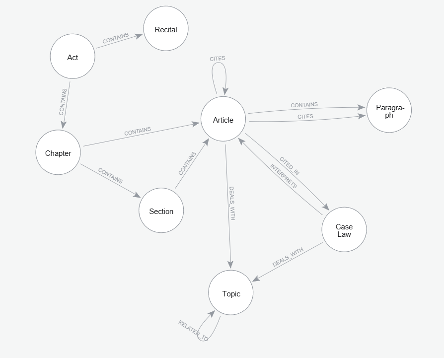

# Legal KG V1.1
## Document assumption
The following knowledge graph is evaluated based on the Eurolex document structure. In particular, the following assumptions were considered:
* Each **act** is composed of one or more **chapters**
* Each **chapter** is composed of one or more **articles**
    * In some cases, **articles** will be divided into **sections** rather than directly into **chapters** (Chapter -> Section -> Article)
* **Articles** may cite other **articles** or **paragraphs**
* An **article** is typically composed of a series of **paragraphs**
* **Case law** interprets **articles**; one or more **case law** may refer to a specific **article** or **act**

## Knowledge Graph


## Nodes
In order to maintain the uniqueness of nodes such as articles or chapters (which remain constant across different documents), it was decided to utilise a string that combines the unique identifier of the act (CELEX) provided by Eurolex and the identifier of the chapter/article, etc.

### Act
```
celex: String 
act_title: String
author: String
publication_date: Datetime
date_of_application: Datetime
eurlex_url: String
```

### Recitals
```
recital_id: String         #CELEX+num_recital
text
```

### Chapter
```
chapter_id: String         #CELEX+num_chapter
chapter_number: String     #Roman numerals -> I, II, III
chapter_title: String
```

### Section
```
section_id: String         #CELEX+num_section
section_title: String
```


### Article
```
article_id: String        #CELEX+num_article
article_title: String
full_text: String
```

### Paragraph
```
paragraph_id: String         #CELEX+num_paragraph
text: String
```

### Case Law
```
case_id: String           #C-594/25
case_title: String
court: String
curia_url: String
lodged_date: Datetime
appellant: String
respondent: String
```

## Document Parsing and Data Retrieval
All the data used to fill the KG is retrieved from EUR-Lex documents. In particular, specific acts are parsed from the English HTML format into a specific structured data object. Furthermore, the document information section is parsed to match the associated case law. 

PS: The parser ignores ongoing case law; we only consider completed case law. (XXX interprets YYY).